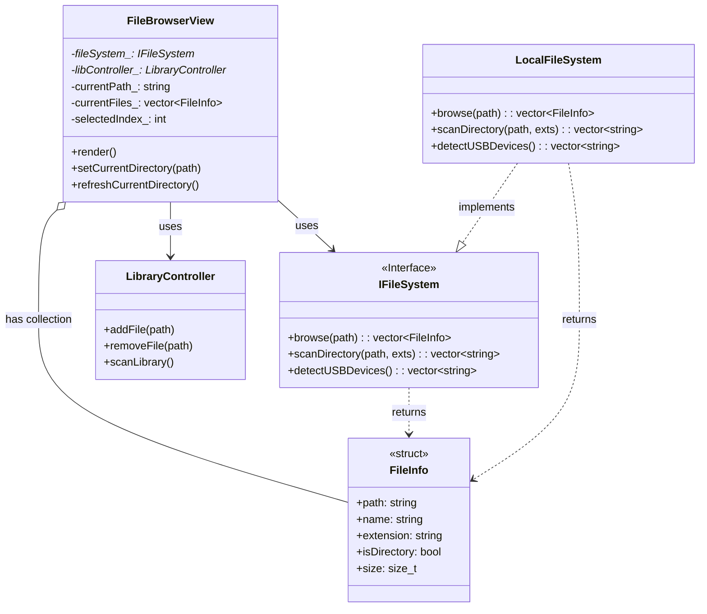

# FileInfo Relationship Diagram

## Corrected UML Relationships

Based on codebase analysis, here are the **correct** relationships:

## Relationship Summary

| Class | Relationship Type | UML Symbol | Evidence |
|-------|------------------|------------|----------|
| **FileBrowserView** | **Aggregation** | `o--` | Line 68: `std::vector<FileInfo> currentFiles_;` |
| **IFileSystem** | **Dependency** | `..>` | Line 40: `virtual std::vector<FileInfo> browse(...)` (return only) |
| **LocalFileSystem** | **Dependency** | `..>` | Line 34: `std::vector<FileInfo> browse(...)` (return only) |

## Key Points

### ✅ Aggregation (FileBrowserView)
- **Has-a relationship** with collection ownership
- `FileBrowserView` stores `vector<FileInfo>` as member variable
- Lifecycle: FileInfo objects can be replaced/cleared without destroying FileBrowserView

### ✅ Dependency (IFileSystem/LocalFileSystem)
- **Uses relationship** without ownership
- FileInfo only appears as return type
- No member variables of type FileInfo
- Temporary usage in function scope only
