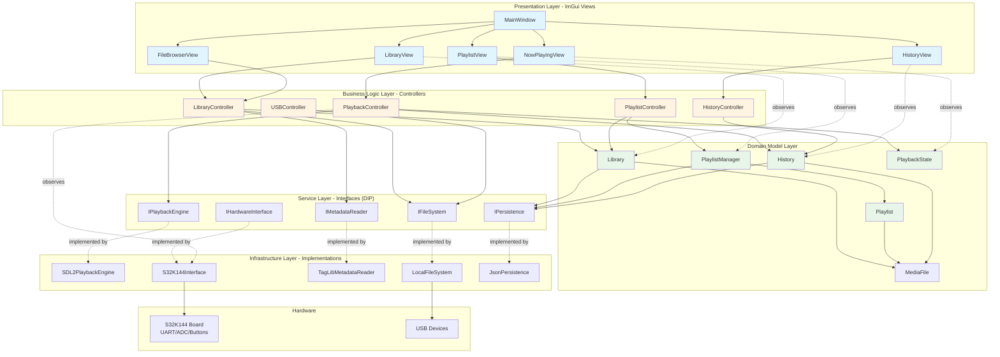
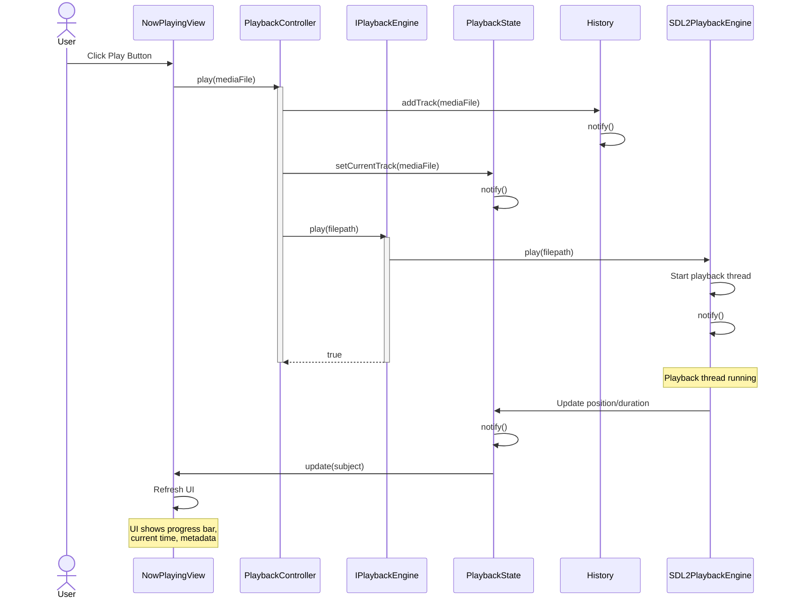
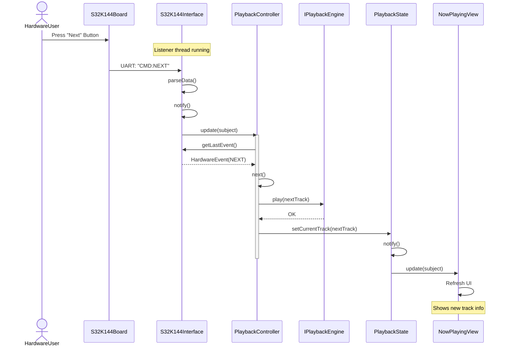
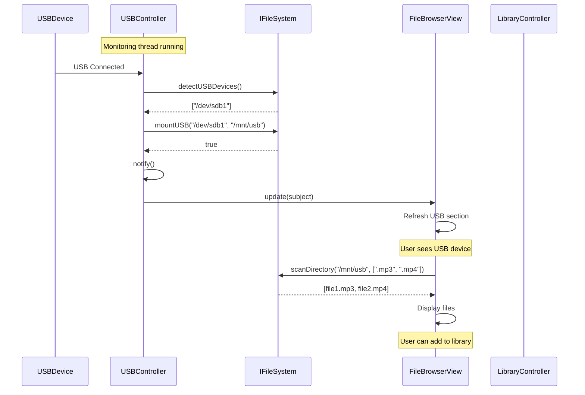
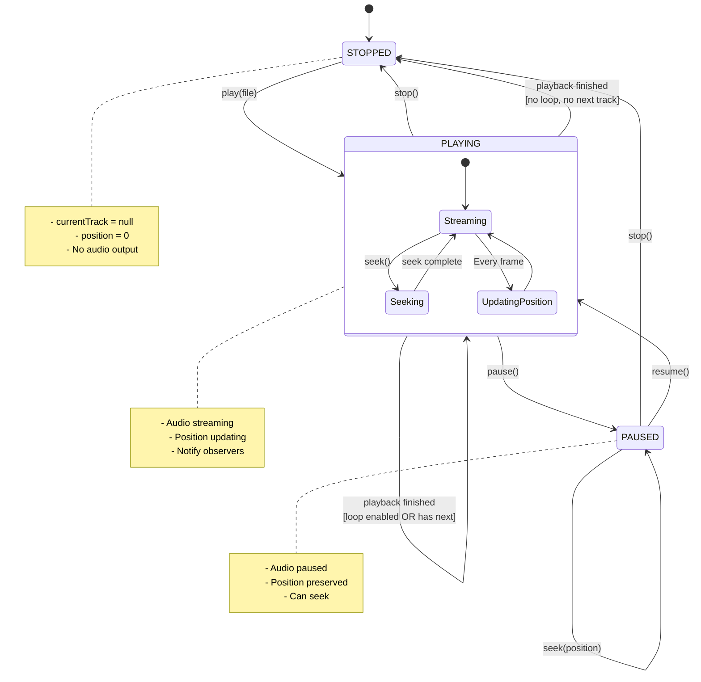
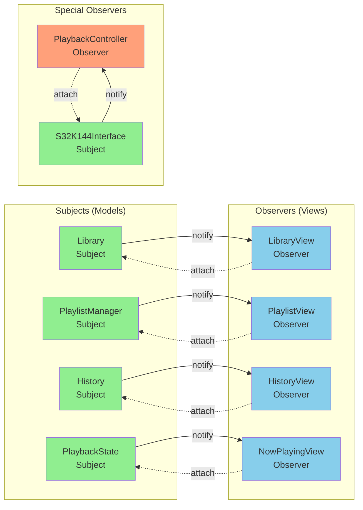
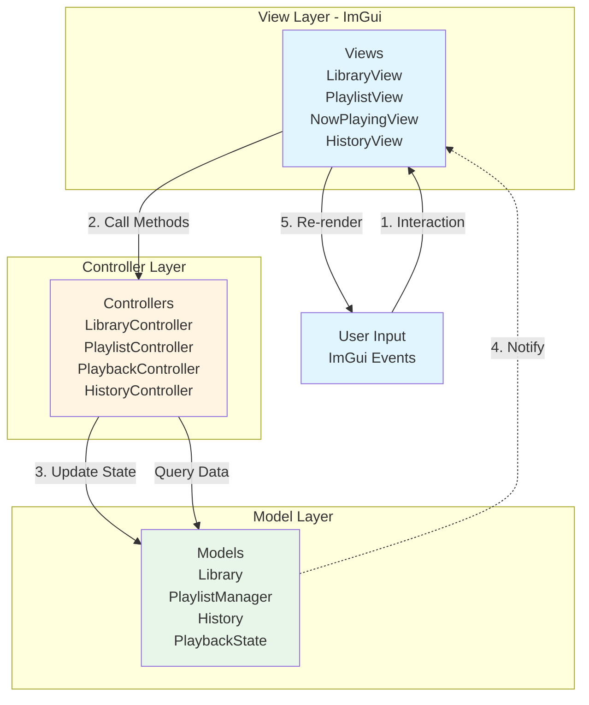

# Music Player Architecture Diagrams

> [!IMPORTANT]
> **Corrected & Enhanced Architecture** - These diagrams reflect ALL critical fixes:
> 
> **Applied Fixes:**
> - ✅ `PlaybackStatus` enum (renamed from `PlaybackState` to avoid recursive type)
> - ✅ `PlaybackState` has `playQueue_` + `queueIndex_` for Next track functionality
> - ✅ `PlaybackController` has `IHardwareInterface* hardware_` for LCD write access
> - ✅ `MediaType` enum added (AUDIO/VIDEO/IMAGE/UNKNOWN) for type safety
> - ✅ `Subject` is thread-safe with `std::mutex mutex_` protection
> - ✅ `MediaMetadata` enhanced (sampleRate, channels, hasAlbumArt, MediaType)
> 
> See: [Critical Fixes](file:///wsl.localhost/Ubuntu/home/duong/music_player/docs/02_Design/critical_fixes.md) | [Review](file:///wsl.localhost/Ubuntu/home/duong/music_player/docs/02_Design/architecture_review_final.md)

## 1. Component Architecture Diagram



# New Class Diagram Content

Replace section 2 "Class Diagram - Core Relationships" in architecture_diagrams.md from line 140 to line 426 with this:

```mermaid
classDiagram

    %% ========================================
    %% OBSERVER PATTERN FOUNDATION
    %% ========================================
    class IObserver {
        <<interface>>
        +update(subject)*
    }
   
    class ISubject {
        <<interface>>
        +attach(observer)*
        +detach(observer)*
        +notify()*
    }
   
    class Subject {
        <<abstract>>
        #observers: vector~IObserver*~
        #observerMutex: mutex
        +attach(observer)
        +detach(observer)
        +notify()
    }
   
    %% ========================================
    %% ENUMERATIONS & VALUE OBJECTS
    %% ========================================
    class PlaybackStatus {
        <<enumeration>>
        STOPPED
        PLAYING
        PAUSED
    }
   
    class MediaType {
        <<enumeration>>
        AUDIO
        VIDEO
        IMAGE
        UNKNOWN
    }
   
    class MediaMetadata {
        <<value object>>
        +title: string
        +artist: string
        +album: string
        +duration: double
        +bitrate: int
        +sampleRate: int
        +channels: int
        +hasAlbumArt: bool
    }
   
    %% ========================================
    %% SERVICE LAYER - INTERFACES
    %% ========================================
    class IPlaybackEngine {
        <<interface>>
        +play(filepath) bool*
        +pause()*
        +resume()*
        +stop()*
        +seek(position)*
        +setVolume(volume)*
        +getState() PlaybackStatus*
        +getPosition() double*
        +getDuration() double*
    }
   
    class IFileSystem {
        <<interface>>
        +browse(path) vector~string~*
        +scanDirectory(path, extensions) vector~string~*
        +detectUSBDevices() vector~string~*
        +mountUSB(device, mountPoint) bool*
        +unmountUSB(mountPoint) bool*
        +fileExists(path) bool*
    }
   
    class IMetadataReader {
        <<interface>>
        +readMetadata(filepath) MediaMetadata*
        +writeMetadata(filepath, metadata) bool*
        +canWrite(filepath) bool*
    }
   
    class IHardwareInterface {
        <<interface>>
        +initialize(port, baudRate) bool*
        +sendCommand(command)*
        +readData() string*
        +displayText(text)*
        +readADC() int*
        +isConnected() bool*
    }
   
    class IPersistence {
        <<interface>>
        +saveToFile(filepath, data) bool*
        +loadFromFile(filepath) string*
        +fileExists(filepath) bool*
    }
   
    %% ========================================
    %% SERVICE LAYER - IMPLEMENTATIONS
    %% ========================================
    class SDL2PlaybackEngine {
        -playbackThread: thread
        -status: PlaybackStatus
        -dataMutex: mutex
        -audioSpec: SDL_AudioSpec
        -currentPosition: double
        -totalDuration: double
        +play(filepath) bool
        +pause()
        +resume()
        +stop()
        +getState() PlaybackStatus
        -playbackLoop()
    }
   
    class LocalFileSystem {
        -allowedPaths: vector~string~
        +browse(path) vector~string~
        +scanDirectory(path, extensions) vector~string~
        +detectUSBDevices() vector~string~
        +mountUSB(device, mountPoint) bool
        -isPathAllowed(path) bool
    }
   
    class TagLibMetadataReader {
        +readMetadata(filepath) MediaMetadata
        +writeMetadata(filepath, metadata) bool
        +canWrite(filepath) bool
        -extractAudioMetadata(file) MediaMetadata
        -extractVideoMetadata(file) MediaMetadata
    }
   
    class S32K144Interface {
        -serialFd: int
        -listenerThread: thread
        -running: atomic~bool~
        -lastCommand: string
        -dataMutex: mutex
        +initialize(port, baudRate) bool
        +sendCommand(command)
        +displayText(text)
        +readADC() int
        -startListening()
        -parseData(data)
    }
   
    class JsonPersistence {
        +saveToFile(filepath, data) bool
        +loadFromFile(filepath) string
        +fileExists(filepath) bool
        -validateJson(data) bool
    }
   
    %% ========================================
    %% MODEL LAYER - DOMAIN ENTITIES
    %% ========================================
    class MediaFile {
        <<entity>>
        -filepath: string
        -metadata: MediaMetadata
        -type: MediaType
        -inLibrary: bool
        -addedDate: time_t
        +getDisplayName() string
        +getFilepath() string
        +getMetadata() MediaMetadata
        +isInLibrary() bool
        +setInLibrary(flag)
    }
   
    class Library {
        <<aggregate root>>
        -mediaFiles: vector~MediaFile~
        -persistence: IPersistence*
        -dataMutex: mutex
        -filepath: string
        +addMedia(file)
        +removeMedia(filepath)
        +search(query) vector~MediaFile~
        +getAll() vector~MediaFile~
        +contains(filepath) bool
        +save()
        +load()
    }
   
    class Playlist {
        <<entity>>
        -name: string
        -tracks: vector~MediaFile~
        -loopEnabled: bool
        -shuffleEnabled: bool
        -dataMutex: mutex
        +addTrack(track)
        +removeTrack(index)
        +getTrack(index) MediaFile
        +shuffle()
        +getTracks() vector~MediaFile~
        +setLoop(enabled)
    }
   
    class PlaylistManager {
        <<aggregate root>>
        -playlists: map~string, Playlist~
        -persistence: IPersistence*
        -dataMutex: mutex
        -playlistDir: string
        +createPlaylist(name) Playlist*
        +deletePlaylist(name) bool
        +getPlaylist(name) Playlist*
        +getAllPlaylists() vector~string~
        +save()
        +load()
    }
   
    class History {
        <<entity>>
        -history: vector~MediaFile~
        -maxSize: size_t
        -dataMutex: mutex
        -persistence: IPersistence*
        +addTrack(track)
        +removeTrack(index)
        +clear()
        +getHistory() vector~MediaFile~
        +save()
        +load()
    }
   
    class PlaybackState {
        <<aggregate root>>
        -currentTrack: MediaFile*
        -status: PlaybackStatus
        -volume: float
        -position: double
        -backStack: stack~MediaFile~
        -playQueue: vector~MediaFile~
        -queueIndex: size_t
        -dataMutex: mutex
        +setCurrentTrack(track)
        +getCurrentTrack() MediaFile*
        +setStatus(status)
        +getStatus() PlaybackStatus
        +setVolume(volume)
        +getVolume() float
        +setPosition(position)
        +getPosition() double
        +pushToBackStack()
        +popFromBackStack() MediaFile*
        +setPlayQueue(queue)
        +getNextTrack() MediaFile*
        +getPreviousTrack() MediaFile*
        +hasNextTrack() bool
    }
   
    %% ========================================
    %% CONTROLLER LAYER
    %% ========================================
    class LibraryController {
        -library: Library*
        -fileSystem: IFileSystem*
        -metadataReader: IMetadataReader*
        +addMediaFilesFromDirectory(path)
        +addMediaFile(filepath)
        +removeMediaFile(filepath)
        +searchMedia(query) vector~MediaFile~
        +getAllMedia() vector~MediaFile~
        +saveLibrary()
        +loadLibrary()
    }
   
    class PlaylistController {
        -playlistManager: PlaylistManager*
        -library: Library*
        +createPlaylist(name)
        +deletePlaylist(name)
        +renamePlaylist(oldName, newName)
        +addTrackToPlaylist(playlist, track)
        +removeTrackFromPlaylist(playlist, index)
        +getPlaylist(name) Playlist*
        +getAllPlaylists() vector~string~
        +savePlaylists()
        +loadPlaylists()
    }
   
    class PlaybackController {
        -engine: IPlaybackEngine*
        -state: PlaybackState*
        -history: History*
        -hardware: IHardwareInterface*
        -currentPlaylist: Playlist*
        +play(track)
        +pause()
        +resume()
        +stop()
        +next()
        +previous()
        +seek(position)
        +setVolume(volume)
        +setPlaylist(playlist)
        +update(subject)
        -sendMetadataToHardware(track)
        -handleHardwareEvent()
    }
   
    class HistoryController {
        -history: History*
        +addToHistory(track)
        +removeFromHistory(index)
        +clearHistory()
        +getHistory() vector~MediaFile~
        +saveHistory()
        +loadHistory()
    }
   
    class USBController {
        -fileSystem: IFileSystem*
        -monitorThread: thread
        -running: atomic~bool~
        -mountedDevices: map~string,string~
        +startMonitoring()
        +stopMonitoring()
        +getMountedDevices() vector~string~
        +update(subject)
        -monitorLoop()
        -handleDeviceAdded(device)
        -handleDeviceRemoved(device)
    }
   
    %% ========================================
    %% VIEW LAYER
    %% ========================================
    class IView {
        <<interface>>
        +render()*
        +handleInput()*
        +update(subject)*
        +show()*
        +hide()*
    }
   
    class IViewFactory {
        <<interface>>
        +createMainWindow() IView*
        +createLibraryView(controller, library) IView*
        +createPlaylistView(controller, manager) IView*
        +createNowPlayingView(controller, state) IView*
        +createHistoryView(controller, history) IView*
        +createFileBrowserView(fileSystem, controller) IView*
    }
    
    class ViewFactory {
        +createMainWindow() IView*
        +createLibraryView(controller, library) IView*
        +createPlaylistView(controller, manager) IView*
        +createNowPlayingView(controller, state) IView*
        +createHistoryView(controller, history) IView*
        +createFileBrowserView(fileSystem, controller) IView*
    }
   
    class BaseView {
        <<abstract>>
        #visible: bool
        +render()*
        +handleInput()
        +update(subject)
        +show()
        +hide()
        #renderImpl()*
    }
   
    class LibraryView {
        -controller: LibraryController*
        -library: Library*
        -selectedIndex: int
        -searchQuery: string
        +render()
        +update(subject)
        -renderSearchBar()
        -renderMediaList()
        -handleAddToPlaylist()
    }
   
    class PlaylistView {
        -controller: PlaylistController*
        -playlistManager: PlaylistManager*
        -selectedPlaylist: string
        -selectedTrack: int
        +render()
        +update(subject)
        -renderPlaylistSelector()
        -renderTrackList()
        -handleCreatePlaylist()
    }
   
    class NowPlayingView {
        -controller: PlaybackController*
        -state: PlaybackState*
        +render()
        +update(subject)
        -renderProgressBar()
        -renderControls()
        -renderMetadata()
    }
   
    class HistoryView {
        -controller: HistoryController*
        -history: History*
        -selectedIndex: int
        +render()
        +update(subject)
        -renderHistoryList()
        -handlePlayFromHistory()
    }
   
    class FileBrowserView {
        -controller: LibraryController*
        -usbController: USBController*
        -currentPath: string
        -selectedFiles: vector~int~
        +render()
        +update(subject)
        -renderPathNavigator()
        -renderFileList()
        -renderUSBSection()
    }
   
    class MainWindow {
        -views: map~string,IView*~
        -activeView: string
        +render()
        +switchView(name)
        -renderMenuBar()
        -renderStatusBar()
    }
   
    %% ========================================
    %% INHERITANCE RELATIONSHIPS
    %% ========================================
    ISubject <|-- Subject : implements
   
    Subject <|-- Library : extends
    Subject <|-- PlaylistManager : extends
    Subject <|-- Playlist : extends
    Subject <|-- History : extends
    Subject <|-- PlaybackState : extends
    Subject <|-- SDL2PlaybackEngine : extends
    Subject <|-- S32K144Interface : extends
   
    IObserver <|.. IView : implements
    IView <|.. BaseView : implements
   
    BaseView <|-- LibraryView : extends
    BaseView <|-- PlaylistView : extends
    BaseView <|-- NowPlayingView : extends
    BaseView <|-- HistoryView : extends
    BaseView <|-- FileBrowserView : extends
   
    IObserver <|.. PlaybackController : implements
    IObserver <|.. USBController : implements
   
    IPlaybackEngine <|.. SDL2PlaybackEngine : implements
    IFileSystem <|.. LocalFileSystem : implements
    IMetadataReader <|.. TagLibMetadataReader : implements
    IHardwareInterface <|.. S32K144Interface : implements
    IPersistence <|.. JsonPersistence : implements
    
    IViewFactory <|.. ViewFactory : implements
   
    %% ========================================
    %% COMPOSITION - MODEL LAYER
    %% ========================================
    Library *-- MediaFile : contains
    Playlist *-- MediaFile : contains
    History *-- MediaFile : contains
    PlaylistManager *-- Playlist : manages
   
    MediaFile *-- MediaMetadata : has
    MediaFile --> MediaType : uses
    PlaybackState --> PlaybackStatus : uses
    PlaybackState --> MediaFile : references
   
    %% ========================================
    %% DEPENDENCIES - MODEL TO SERVICE
    %% ========================================
    Library --> IPersistence : uses
    PlaylistManager --> IPersistence : uses
    History --> IPersistence : uses
   
    %% ========================================
    %% DEPENDENCIES - CONTROLLER TO MODEL
    %% ========================================
    LibraryController --> Library : manages
   
    PlaylistController --> PlaylistManager : manages
    PlaylistController --> Library : queries
   
    PlaybackController --> PlaybackState : manages
    PlaybackController --> History : updates
    PlaybackController --> Playlist : uses
   
    HistoryController --> History : manages
   
    %% ========================================
    %% DEPENDENCIES - CONTROLLER TO SERVICE
    %% ========================================
    LibraryController --> IFileSystem : uses
    LibraryController --> IMetadataReader : uses
   
    PlaybackController --> IPlaybackEngine : uses
    PlaybackController --> IHardwareInterface : uses
   
    USBController --> IFileSystem : uses
   
    %% ========================================
    %% DEPENDENCIES - VIEW TO CONTROLLER
    %% ========================================
    LibraryView --> LibraryController : calls
    PlaylistView --> PlaylistController : calls
    NowPlayingView --> PlaybackController : calls
    HistoryView --> HistoryController : calls
   
    FileBrowserView --> LibraryController : calls
    FileBrowserView --> USBController : calls
   
    MainWindow --> IView : manages
    ViewFactory --> IView : returns
   
    %% ========================================
    %% OBSERVER PATTERN - VIEW TO MODEL
    %% ========================================
    Library --o LibraryView : notifies
    PlaylistManager --o PlaylistView : notifies
    PlaybackState --o NowPlayingView : notifies
    History --o HistoryView : notifies
   
    %% ========================================
    %% OBSERVER PATTERN - CONTROLLER TO SERVICE
    %% ========================================
    SDL2PlaybackEngine --o PlaybackController : notifies
    S32K144Interface --o PlaybackController : notifies
   
    %% ========================================
    %% STYLING
    %% ========================================
   
    %% Observer Foundation
    style IObserver fill:#e1bee7,stroke:#333,stroke-width:2px
    style ISubject fill:#e1bee7,stroke:#333,stroke-width:2px
    style Subject fill:#ce93d8,stroke:#333,stroke-width:2px
   
    %% Value Objects
    style PlaybackStatus fill:#e0e0e0,stroke:#333,stroke-width:2px
    style MediaType fill:#e0e0e0,stroke:#333,stroke-width:2px
    style MediaMetadata fill:#eeeeee,stroke:#333,stroke-width:2px
   
    %% Service Interfaces
    style IPlaybackEngine fill:#bbdefb,stroke:#333,stroke-width:2px
    style IFileSystem fill:#bbdefb,stroke:#333,stroke-width:2px
    style IMetadataReader fill:#bbdefb,stroke:#333,stroke-width:2px
    style IHardwareInterface fill:#bbdefb,stroke:#333,stroke-width:2px
    style IPersistence fill:#bbdefb,stroke:#333,stroke-width:2px
   
    %% Service Implementations
    style SDL2PlaybackEngine fill:#90caf9,stroke:#333,stroke-width:2px
    style LocalFileSystem fill:#90caf9,stroke:#333,stroke-width:2px
    style TagLibMetadataReader fill:#90caf9,stroke:#333,stroke-width:2px
    style S32K144Interface fill:#90caf9,stroke:#333,stroke-width:2px
    style JsonPersistence fill:#90caf9,stroke:#333,stroke-width:2px
   
    %% Model Layer
    style MediaFile fill:#c8e6c9,stroke:#333,stroke-width:2px
    style Library fill:#a5d6a7,stroke:#333,stroke-width:2px
    style Playlist fill:#a5d6a7,stroke:#333,stroke-width:2px
    style PlaylistManager fill:#81c784,stroke:#333,stroke-width:2px
    style History fill:#a5d6a7,stroke:#333,stroke-width:2px
    style PlaybackState fill:#81c784,stroke:#333,stroke-width:2px
   
    %% Controller Layer
    style LibraryController fill:#ffcc80,stroke:#333,stroke-width:2px
    style PlaylistController fill:#ffcc80,stroke:#333,stroke-width:2px
    style PlaybackController fill:#ffcc80,stroke:#333,stroke-width:2px
    style HistoryController fill:#ffcc80,stroke:#333,stroke-width:2px
    style USBController fill:#ffcc80,stroke:#333,stroke-width:2px
   
    %% View Layer
    style IView fill:#ffccbc,stroke:#333,stroke-width:2px
    style IViewFactory fill:#ffccbc,stroke:#333,stroke-width:2px
    style ViewFactory fill:#ffab91,stroke:#333,stroke-width:2px
    style BaseView fill:#ffab91,stroke:#333,stroke-width:2px
    style LibraryView fill:#ff8a65,stroke:#333,stroke-width:2px
    style PlaylistView fill:#ff8a65,stroke:#333,stroke-width:2px
    style NowPlayingView fill:#ff8a65,stroke:#333,stroke-width:2px
    style HistoryView fill:#ff8a65,stroke:#333,stroke-width:2px
    style FileBrowserView fill:#ff8a65,stroke:#333,stroke-width:2px
    style MainWindow fill:#ff7043,stroke:#333,stroke-width:2px
```


## 3. Sequence Diagram - Play Song Flow



## 4. Sequence Diagram - Hardware Control Flow



## 5. Sequence Diagram - USB Hotplug Detection



## 6. State Machine Diagram - Playback States



## 7. Observer Pattern - Data Flow Diagram



## 8. Dependency Injection Container - Application Class

```mermaid
graph TB
    App[Application<br/>DI Container]
    
    subgraph "Creates Services"
        App --> SDL2[SDL2PlaybackEngine]
        App --> LocalFS[LocalFileSystem]
        App --> TagLib[TagLibMetadataReader]
        App --> S32K[S32K144Interface]
        App --> Json[JsonPersistence]
    end
    
    subgraph "Creates Models"
        App --> Library[Library]
        App --> PlaylistMgr[PlaylistManager]
        App --> History[History]
        App --> PBState[PlaybackState]
    end
    
    subgraph "Creates Controllers"
        App --> LibCtrl[LibraryController]
        App --> PlCtrl[PlaylistController]
        App --> PBCtrl[PlaybackController]
        App --> HistCtrl[HistoryController]
        App --> USBCtrl[USBController]
    end
    
    subgraph "Creates Views"
        App --> MainWin[MainWindow]
        App --> LibView[LibraryView]
        App --> PlView[PlaylistView]
        App --> NPView[NowPlayingView]
        App --> HistView[HistoryView]
        App --> FBView[FileBrowserView]
    end
    
    subgraph "Injects Dependencies"
        LibCtrl -.->|IFileSystem*| LocalFS
        LibCtrl -.->|IMetadataReader*| TagLib
        LibCtrl -.->|Library*| Library
        
        PBCtrl -.->|IPlaybackEngine*| SDL2
        PBCtrl -.->|PlaybackState*| PBState
        PBCtrl -.->|History*| History
        
        LibView -.->|LibraryController*| LibCtrl
        LibView -.->|Library*| Library
        
        NPView -.->|PlaybackController*| PBCtrl
        NPView -.->|PlaybackState*| PBState
    end
    
    subgraph "Wires Observers"
        Library -.->|attach| LibView
        PBState -.->|attach| NPView
        S32K -.->|attach| PBCtrl
    end
    
    style App fill:#ff6b6b
    style SDL2 fill:#51cf66
    style LocalFS fill:#51cf66
    style LibCtrl fill:#ffd43b
    style LibView fill:#74c0fc
```



## 9. MVC Pattern Implementation



## Usage Notes

- **Component Diagram**: Shows overall architecture with all layers
- **Class Diagram**: Shows key classes and their relationships
- **Sequence Diagrams**: Show runtime behavior for key use cases
- **State Machine**: Shows PlaybackState transitions
- **Observer Pattern**: Shows notification flow
- **DI Container**: Shows how Application wires everything together
- **MVC**: Shows the MVC pattern implementation

You can copy any of these Mermaid diagrams into:
- GitHub markdown files (rendered automatically)
- Mermaid Live Editor: https://mermaid.live/
- Documentation tools that support Mermaid
- PlantUML converters if you need UML format
